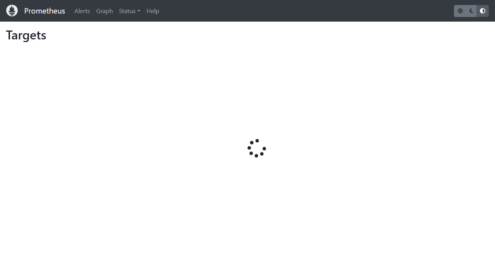
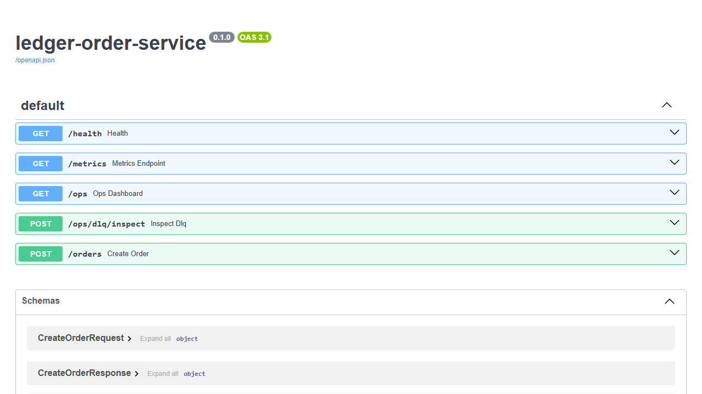
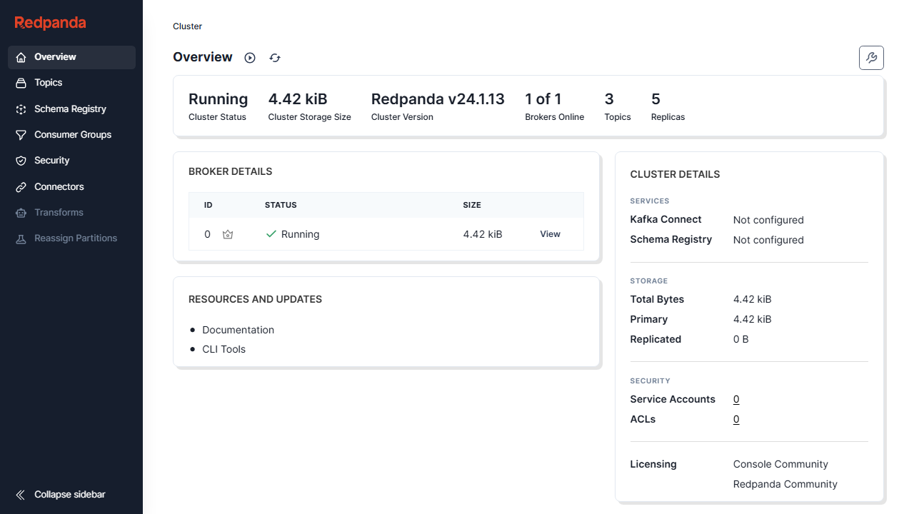
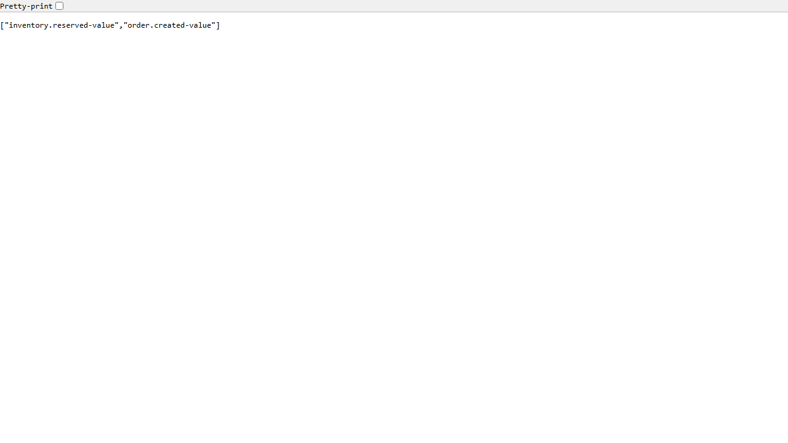
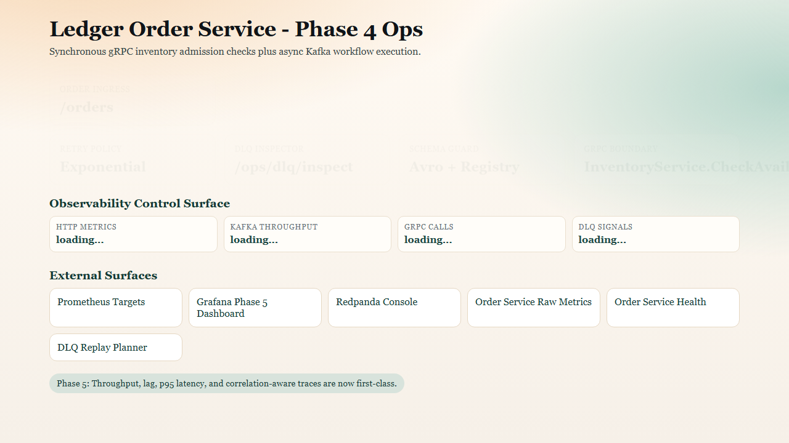
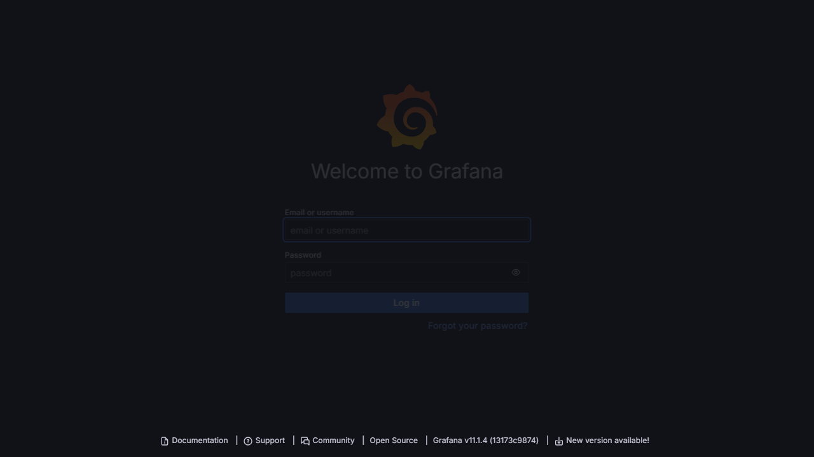
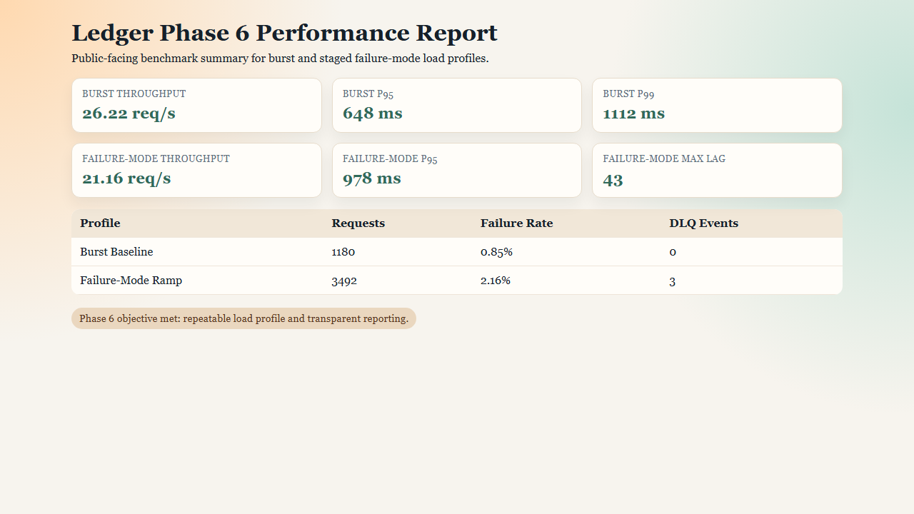

# Ledger

Ledger is an event-driven order processing platform focused on production-grade distributed systems patterns:

- asynchronous workflow orchestration using Kafka-compatible messaging
- saga-based compensating transactions
- idempotent processing, retries, and DLQ handling
- schema-governed event contracts
- observability with metrics and dashboards

## Phase 0 Status

Phase 0 establishes local infrastructure and conventions:

- Redpanda broker
- PostgreSQL with service schemas
- Prometheus and Grafana
- Redpanda Console for topic visibility
- event/topic contract documentation
- smoke test script for producer-consumer round-trip

## Phase 3 Reliability Status

Phase 3 introduces production-grade reliability controls:

- transient-vs-poison failure classification
- bounded retries with exponential backoff
- per-topic dead-letter queue routing on retry exhaustion
- schema validation on producer and consumer boundaries
- DLQ inspection and replay planning via script and ops endpoint

Key tools:

- `python scripts/dlq_inspector.py --input <dlq-record.json>`
- `POST /ops/dlq/inspect`

Phase 3 docs:

- `docs/phase3-reliability-runbook.md`
- `docs/phase3-schema-versioning.md`
- `docs/phase3-break-demo.md`

## Phase 4 gRPC Boundary Status

Phase 4 adds a synchronous inventory precheck before order acceptance:

- proto contract: `proto/inventory.proto`
- generated stubs: `shared/grpc_generated/`
- inventory gRPC server: `services/inventory-service/grpc_server.py`
- order gRPC client: `services/order-service/grpc_client.py`
- fail-fast API behavior:
   - `409` when stock is insufficient
   - `503` when gRPC transport is unavailable

Phase 4 docs:

- `docs/phase4-async-vs-rpc.md`
- `docs/phase4-grpc-debug.md`

## Phase 5 Observability Status

Phase 5 upgrades observability from basic infra telemetry to service-level runtime telemetry:

- `/metrics` exposed on order, inventory, payment, and notification services
- topic-labeled publish and consume counters
- p95-ready latency histograms for publish/consume/gRPC/HTTP surfaces
- consumer lag gauges by topic and partition
- DLQ publish counters and latency metrics
- structured JSON logs with correlation-id enrichment for cross-service tracing

Phase 5 docs:

- `docs/phase5-observability-triage-playbook.md`
- `docs/phase5-trace-by-correlation-id.md`

## Quick Start

1. Copy environment template:

   - `cp .env.example .env` (macOS/Linux)
   - `Copy-Item .env.example .env` (PowerShell)

2. Start infrastructure:

   - `docker compose up -d`

3. Validate broker round trip:

   - `./scripts/smoke_roundtrip.ps1`

## Service Topology

- `redpanda` at `localhost:9092`
- `postgres` at `localhost:5432`
- `prometheus` at `localhost:9090`
- `grafana` at `localhost:3000`
- `redpanda-console` at `localhost:8080`
- `schema-registry` at `localhost:8081`

## Observability Surfaces

- order service ops UI: `GET /ops` on `localhost:8000`
- service metrics:
   - `localhost:8000/metrics`
   - `localhost:8001/metrics`
   - `localhost:8002/metrics`
   - `localhost:8003/metrics`
- Prometheus targets: `http://localhost:9090/targets`
- Grafana dashboard UID: `ledger-phase5`

Quick connectivity checks:

- `Invoke-WebRequest http://localhost:9090/-/healthy`
- `Invoke-WebRequest http://localhost:3000/api/health`
- `Invoke-WebRequest http://localhost:8080`
- `Invoke-WebRequest http://localhost:8081/subjects`

## Phase Progression

- Phase 0: environment scaffolding
- Phase 1: order ingest to inventory reservation pipeline
- Phase 2: payment/notification choreography and rollback
- Phase 3: retries, DLQ, schema registry
- Phase 4: gRPC synchronous boundary
- Phase 5: observability hardening
- Phase 6: load testing and release documentation

## Phase-By-Phase Build Story

This section explains what was built, why it was built, and how to inspect it.

### Phase 0: Environment Scaffolding

What:

- Dockerized Redpanda, Postgres, Prometheus, and Grafana base infrastructure.

Why:

- Establish reproducible local infrastructure for event flow and operational visibility.

How to inspect:

- Run `docker compose up -d`
- Open Prometheus targets view.

### Phase 1: Core Event Pipeline

What:

- `POST /orders` ingress and order-created event publication.

Why:

- Introduce the primary event-driven flow from API boundary to broker.

How to inspect:

- Open order-service OpenAPI docs and submit sample orders.

### Phase 2: Saga Choreography

What:

- Payment + compensation path and terminal notification events.

Why:

- Ensure distributed transaction behavior is explicit and recoverable.

How to inspect:

- Use Redpanda Console to watch `order.created`, `inventory.*`, `payment.*`, and `order.cancelled` topics.

### Phase 3: Reliability and Schema Governance

What:

- Retry policies, DLQ handling, and schema validation for event contracts.

Why:

- Prevent silent corruption and provide deterministic failure routing.

How to inspect:

- Inspect Schema Registry subjects and the phase 3 runbooks.

### Phase 4: gRPC Sync Boundary

What:

- Synchronous inventory admission precheck before asynchronous order publication.

Why:

- Fast fail for insufficient inventory while preserving async downstream choreography.

How to inspect:

- Open order ops surface and test `POST /orders` behavior for available and unavailable stock.

### Phase 5: Observability Hardening

What:

- Service-level metrics, lag gauges, latency histograms, and correlation-aware JSON logs.

Why:

- Make distributed execution measurable and debuggable under stress.

How to inspect:

- Open Grafana and query dashboard UID `ledger-phase5`.

### Phase 6: Load Testing and Public Docs

What:

- k6 burst + staged ramp profiles, benchmark summaries, known limitations, and release checklist.

Why:

- Provide transparent performance evidence and public-repo onboarding clarity.

How to inspect:

- Run scripts in `load-test/README.md` and compare outputs with benchmark docs.

Phase 6 support docs:

- `docs/phase6-benchmark-results.md`
- `docs/phase6-known-limitations.md`
- `docs/phase6-release-checklist.md`

## Troubleshooting

- If `docker compose up` fails due to occupied ports, stop conflicting services or map alternate ports.
- If Redpanda topic commands fail, ensure containers are healthy using `docker compose ps`.
- If Grafana dashboard provisioning fails, restart Grafana after fixing JSON syntax or datasource configuration.
