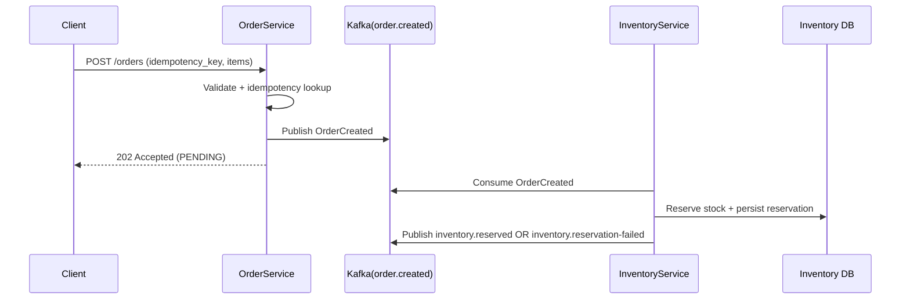

# Phase 1 Sequence And Demo Steps

## Sequence Diagram

## Demo Steps

1. Start infra:
   - `docker compose up -d`
2. Start order service:
   - `uvicorn main:app --app-dir services/order-service --port 8000 --reload`
3. Start inventory service process loop (or call consumer handler from a harness).
4. Open ops UI:
   - `http://localhost:8000/ops`
5. Submit an order:
   - `POST /orders` with idempotency key and one item.
6. Verify emitted event on `order.created`.
7. Verify inventory outcome event on either:
   - `inventory.reserved`
   - `inventory.reservation-failed`

## Acceptance Criteria

- `/orders` returns `202`.
- Duplicate idempotency key returns the existing order identity.
- Inventory reservation state persists and emits outcome events.
- Consumer offset commits happen only after successful handling.
