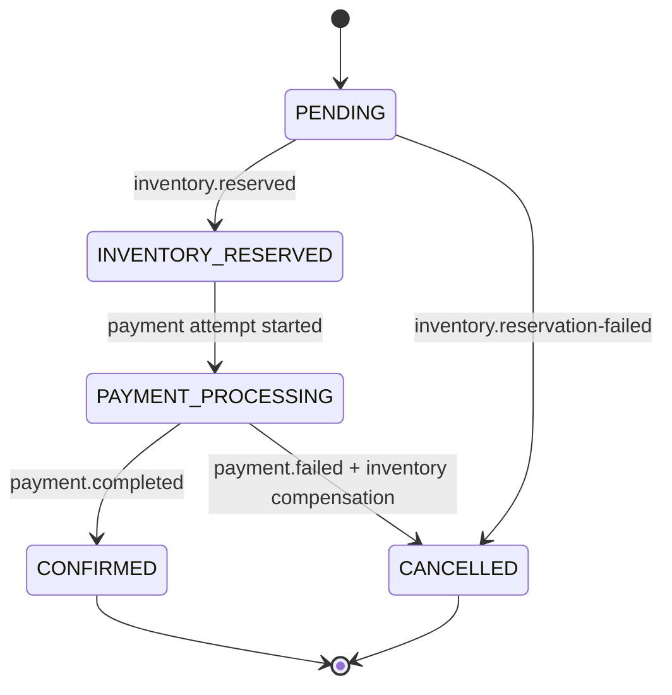

# Phase 2 Saga State Machine And Failure Walkthrough

## Order State Machine

## Event Choreography

1. Order Service publishes OrderCreated to order.created.
2. Inventory Service reserves stock and emits inventory.reserved.
3. Payment Service consumes inventory.reserved.
4. On success, Payment Service emits payment.completed.
5. Order Service consumes payment.completed and marks order CONFIRMED.
6. Notification Service consumes payment.completed and logs terminal notification.

## Failure Walkthrough: Payment Fails After Reservation

1. OrderCreated is accepted and inventory is reserved.
2. Payment Service emits payment.failed.
3. Inventory Service consumes payment.failed and restores reservation.
4. Inventory Service emits compensating order.cancelled.
5. Order Service consumes order.cancelled and marks order CANCELLED.
6. Notification Service logs a cancellation terminal event.

## Consistency Guarantees

- Delivery model: at-least-once.
- Duplicate handling: consumers use processed-event tracking.
- Compensation behavior: inventory restoration plus explicit cancellation event.
